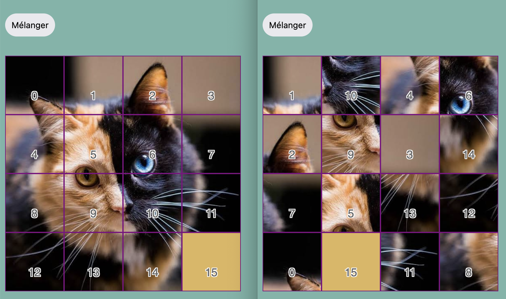

# Quelle Tuile

Voici un projet de programmation en jQuery que j'ai réalisé en binôme lors de la première année de ma licence en informatique pour l'UE "Programmation Web 1". Il s'agit d'un jeu de puzzle.

Dans ce jeu de puzzle vous devez déplacer les tuiles un par un dans la tuile vide pour les arranger correctement et avoir l'image finale.

Le [sujet du projet](https://github.com/GreengagePlum/quelle-tuile/blob/main/Sujet.pdf) sous format pdf reste disponible pour votre consultation.

## Étudiants

**Efe ERKEN**, **İlber GÖKAL**

Année : L1S2 Printemps 2022

Groupes : 4b, 3b

## Utilisation

* Assurez vous d'avoir une connexion internet (pour charger la bibliothèque jQuery)
* Ouvrez le fichier `index.html` dans votre navigateur de web préféré
* Assurez vous que JavaScript n'est pas bloqué pour cette page dans les paramètres de votre navigateur

## Comment jouer ?

Une fois vous avez lancé le jeu dans votre navigateur, vous êtes prêts à jouer. Essayez de mémoriser l'image correcte avant de commencer en appuyant sur le bouton `Mélanger`. Une fois les tuiles mélangées, essayez de reformer l'image du départ en déplaçant les tuiles adjacent à la tuile vide. Vous avez un nombre illimité de coups. Bonne chance !
