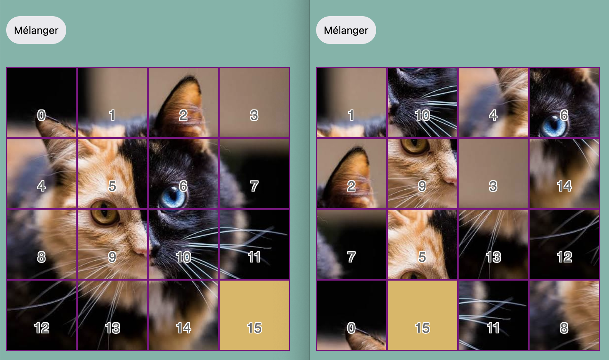

# What a tile

Here is a programming project in jQuery that I did in pairs during the first year of my Computer Science degree for the class of "Web Programming 1". It consists of a puzzle game.

In this puzzle game you have to move the tiles one by one into the empty tile to put them in the correct order and obtain the final image.

The [project paper](https://github.com/GreengagePlum/quelle-tuile/blob/main/Sujet.pdf) (in French) in pdf format is available for your viewing.

## Students

**Efe ERKEN**, **İlber GÖKAL**

Year: L1S2 Printemps 2022

Groups: 4b, 3b

## Usage

* Ensure you have an internet connection (to load the jQuery library)
* Open the `index.html` file in your favorite web browser
* Ensure JavaScript is not blocked for this page inside your web browser's settings

## How to play?

Once you've launched the game in your browser, you are ready to play. Try to memorize the correct image before starting by clicking on the `Mélanger` button. Once the tiles are mixed, try to recreate the initial image by moving the adjacent tiles to the empty tile. You have an unlimited number of moves. Good luck!
